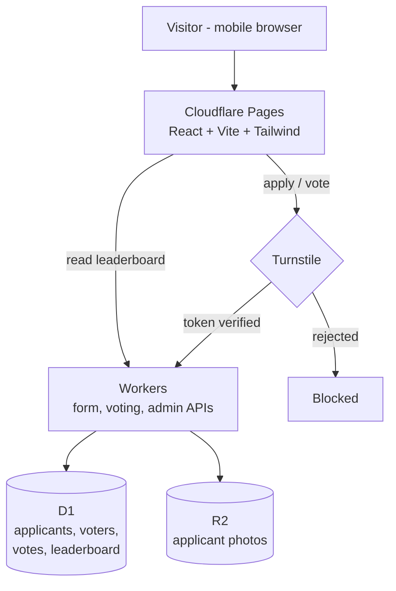

# Clario

A mobile-first web app where people apply, and visitors vote on applicants.
Applications, voting, and the resulting leaderboard run entirely on Cloudflare's
edge platform.

> **Status: early.** The stack below is decided; the application code is not yet
> committed. Sections describing project layout and commands reflect the intended
> shape, not what is currently in the repository.

## Stack

### Frontend

| | |
|---|---|
| **React** | UI |
| **Vite** | Build tool and dev server |
| **TypeScript** | Language |
| **Tailwind CSS** | Styling — mobile-first |

### Cloudflare

| | |
|---|---|
| **Pages** | Hosts the mobile-first site |
| **Workers** | Form submissions, voting, and admin APIs |
| **D1** | Applicants, voters, votes, leaderboard |
| **R2** | Applicant photos |
| **Turnstile** | Blocks bots and automated voting |

### Development

| | |
|---|---|
| **GitHub** | Source-code repository |

## Architecture



Every write path — application submission and vote casting — passes a Turnstile
check before the Worker will touch D1 or R2.

## Planned layout

```
src/            React app (Vite + TypeScript + Tailwind)
workers/        Worker handlers: applications, voting, admin
migrations/     D1 schema migrations
docs/           Working notes
wrangler.toml   Cloudflare bindings (D1, R2, secrets)
```

## Local development

```bash
npm install
npm run dev
```

Workers and bindings run locally through Wrangler:

```bash
npx wrangler dev
```

D1 migrations apply locally first, then to the remote database:

```bash
npx wrangler d1 migrations apply clario --local
```

## Configuration

Bindings for D1, R2, and Pages are declared in `wrangler.toml`. Secrets are **not**
committed — set them with `wrangler secret put`:

| Secret | Purpose |
|---|---|
| `TURNSTILE_SECRET_KEY` | Server-side Turnstile verification |
| `ADMIN_TOKEN` | Guards the admin API |

The Turnstile **site key** is public and belongs in frontend config; the **secret
key** is server-side only and must never reach the client bundle.

## A note on assets

Local working media lives in an `assests/` folder on disk that is **intentionally
untracked**. Both `assests/` and `assets/` are ignored, so renaming the folder to
the correct spelling will not accidentally start publishing its contents. If you
clone this repo, that folder will be absent — that is expected.

Applicant photos are served from R2 and are never stored in git.
